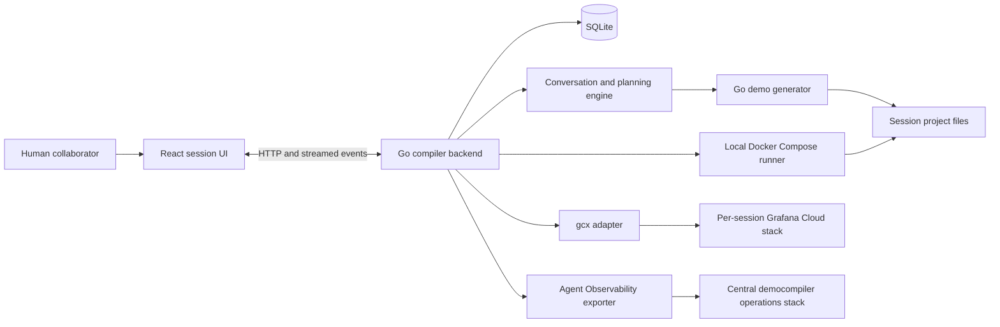
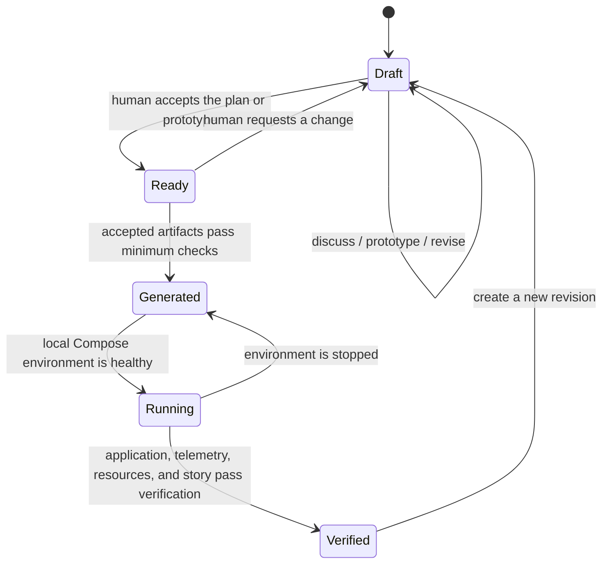

# Grafana Demo Compiler MVP Working Plan

## Purpose of this document

This is the detailed working plan and product specification for the MVP. It is
the source of truth for what we have agreed, what each delivery step must do,
and what remains undecided. It is deliberately more detailed than an executive
roadmap so implementation can proceed without rediscovering product decisions.

The plan will evolve through pull requests. Changes to scope or behavior should
update the decision log so the repository retains an audit trail.

## Product outcome

Grafana Demo Compiler is a persistent, collaborative assistant that helps a
human turn a demo idea into a small, runnable, story-led Grafana demo.

The experience should feel like working with a skilled solutions engineer. The
assistant listens, identifies important gaps, asks a few focused questions,
proposes a narrative and architecture, and offers something tangible as soon as
there is enough context. The human remains in control and can keep planning,
request an early prototype, change direction, or refine an existing prototype.

The narrative is the source of truth. Generated services, telemetry, Grafana
resources, scenarios, and presenter material exist to prove the audience
outcome agreed with the user. A technically rich environment that does not tell
the requested story is a failed demo.

The finished demo must:

- start locally within a target of five minutes;
- fit into a presentation of no more than ten minutes;
- contain at least three interacting Go application services and MySQL;
- run with Docker Compose on the user's machine;
- send application telemetry through Grafana Alloy;
- use a dedicated Grafana Cloud demo stack created through `gcx`;
- remain understandable, repeatable, and easy to revise.

## Product principles

### Story before artifacts

Every service, signal, dashboard, alert, SLO, and scenario must earn its place
by supporting the agreed narrative. The compiler does not create observability
content merely because it can.

### Collaborate rather than interrogate

The assistant asks only questions that affect the demo. It groups closely
related gaps into a small number of targeted questions, reflects its
understanding, and proposes sensible options with reasons. It does not present
the user with a long form to complete.

### Ask rather than assume

When a material requirement has multiple reasonable interpretations, the
assistant stops and asks. This particularly applies to audience, desired
outcome, domain, business stakes, failure scenario, application behavior,
telemetry, Grafana resources, and destructive or remote actions.

### Show useful work early

Planning and building form a feedback loop. Once the assistant understands a
coherent vertical slice, it offers to create a prototype. The user may accept,
ask for a smaller prototype, or continue the conversation. A prototype is not
treated as a final commitment.

### Keep the user informed

No long-running action should disappear behind a spinner. Generation, builds,
container startup, `gcx` operations, and validation publish short progress
events containing the current activity, the result so far, and what comes next.
The UI keeps partial output available when a later action fails.

### Keep the MVP small

The MVP optimizes for a complete, useful path rather than breadth. It avoids a
marketplace, multi-user workflows, CI, cloud application deployment, elaborate
policy engines, and generated service test suites.

## Scope boundaries

### Included

- Go compiler backend, React UI, and SQLite persistence.
- Persistent single-user demo sessions.
- A visible conversation and activity timeline.
- A lightweight living brief derived from the conversation.
- Targeted clarification and explicit human decisions.
- Mermaid.js architecture diagrams.
- Iterative prototype generation and revision.
- At least three generated Go application services.
- MySQL for generated application data.
- Local execution with Docker Compose.
- Grafana Alloy for application telemetry.
- One dedicated Grafana Cloud stack per demo session, created and managed by
  `gcx`.
- A minimal, story-specific set of agreed Grafana resources.
- Deterministic demo trigger, recovery, and reset actions.
- A presenter runbook for a demo of no more than ten minutes.
- Telemetry and resource verification through `gcx`.
- Agent Observability telemetry sent to the central operations stack at
  `https://democompiler.grafana.net/` using the `democompiler` gcx context.
- One evaluation: whether the plan or result answers the demo requirement.
- One guard: application deployment is restricted to the local machine.

### Excluded

- Application deployment to AWS, Azure, GCP, Kubernetes, or any other remote
  runtime.
- Generated application services in languages other than Go.
- Multi-user collaboration, sharing, and role-based access control.
- CI as a prerequisite for MVP development or generated projects.
- A large blueprint or template marketplace.
- Autonomous Grafana mutations without a human preview and approval.
- Generated unit or integration tests for application services.
- AutoBrenda or any AutoBrenda workflow, integration, terminology, or asset.

## How the product is organized

The compiler has six logical parts. These are product responsibilities, not a
requirement to split the compiler into six deployable services.



- The React UI houses sessions, conversation, the living brief, architecture,
  revisions, generation progress, and runtime controls.
- The Go backend owns orchestration, persistence, policy enforcement, tool
  execution, progress events, and recovery after restart.
- SQLite stores session metadata, messages, brief snapshots, decisions,
  revisions, operations, and references to generated files.
- The planning engine turns conversation into proposals without silently
  filling material gaps.
- The generator combines a deterministic Go/Docker foundation with
  domain-specific behavior from the approved or active brief.
- The runtime and `gcx` adapters execute local Docker and Grafana operations
  through narrow, auditable interfaces.

## Core product model

### Demo session

A session represents one demo and survives application restarts. It contains:

- stable session ID and human-readable title;
- created and updated timestamps;
- current user-visible state;
- complete conversation history;
- activity and tool-operation history;
- the current living brief;
- prototype iterations and accepted revisions;
- generated artifact locations and manifests;
- local runtime status and recent runtime evidence;
- dedicated Grafana Cloud stack and `gcx` context identifiers when created;
- approvals, evaluation results, guard outcomes, and validation evidence.

Deleting sessions is not required in Milestone 1. The plan must define a safe
archive or delete experience before destructive session management is added.

### Living brief

The brief is a compact, continuously updated view of shared understanding. It
is not a gate-heavy contract and it is not a second conversation transcript.
Each material item is one of:

- `unknown`: needed or potentially relevant, but not yet understood;
- `proposed`: suggested by the assistant and awaiting human response;
- `confirmed`: stated or accepted by the human.

The brief records, when relevant:

- audience and expected technical depth;
- company, industry, branding, terminology, and constraints;
- desired audience outcome;
- business stakes and the demo-to-win message;
- proof points the audience needs to see;
- primary user or operational journey;
- core scenario, degradation or failure, diagnosis, recovery, and reset;
- application services and their responsibilities;
- important telemetry needed to tell the story;
- requested and proposed Grafana resources;
- timed narrative and presenter flow;
- explicit acceptance criteria;
- open questions and confirmed decisions.

The brief should stay readable in the UI. Long explanations remain in the
conversation and are linked from the relevant decision rather than copied into
every field.

### Prototype iteration

A prototype iteration is a generated snapshot inside the active draft. It has:

- an iteration number and timestamp;
- the brief snapshot that caused it;
- generated artifact manifest;
- generation and validation status;
- a concise human-readable change summary;
- known limitations or unresolved questions;
- an optional local runtime record.

Several iterations can exist while the session remains `Draft`. Prototype
iterations are intended for fast feedback and do not require the planning brief
to be final.

### Accepted revision

When the user accepts the current direction, the compiler records an immutable
revision containing the brief, Mermaid source, narrative, artifact manifest,
and approval evidence. Restoring an old revision creates a new draft based on
that revision; it never rewrites history or mutates Grafana resources by
itself.

### Session states

The user-visible lifecycle is:



State transitions do not erase previous evidence. A failed operation is shown
on the relevant iteration or revision rather than inventing a separate global
`Failed` state.

## Collaborative interaction model

### Discovery behavior

For each user message, the assistant should:

1. identify new facts, corrections, requests, and ambiguities;
2. update proposed or confirmed brief items;
3. explain any material inference as a proposal;
4. ask only the smallest set of questions needed to make progress;
5. provide a useful partial result, such as a narrative, Mermaid update, or
   prototype offer, whenever possible.

The assistant should not repeatedly ask for details the human has already
provided. If a new instruction conflicts with an earlier decision, it surfaces
the conflict and asks which direction should govern before regenerating
affected artifacts.

### When to offer a prototype

The assistant offers a prototype when all of the following are sufficiently
understood for one coherent vertical slice:

- the audience and desired outcome;
- a core scenario or operational question;
- a meaningful beginning-to-end journey;
- a small architecture with at least three Go services and MySQL;
- no unresolved issue that would fundamentally change that slice.

Not every brief item must be confirmed. The offer states what will be built,
which assumptions remain proposed, what will be left for later, and that the
user may continue planning instead.

### Narrative behavior

The assistant develops the story alongside the system. The narrative should
answer:

- Who is watching?
- What do they care about?
- What normal behavior will they see?
- What changes or fails?
- How will the presenter use Grafana to understand it?
- What action resolves it?
- What business or technical outcome has been proven?

The final runbook is capped at ten minutes. Earlier versions can be incomplete,
but the assistant highlights when the planned story cannot fit the limit and
helps the user narrow it.

### Telemetry and Grafana resource behavior

The assistant makes a short, plain-language proposal rather than asking the
human to approve a formal telemetry contract. The proposal says:

- which signals matter to the story;
- which services will emit them;
- which small set of Grafana resources would make the evidence clear;
- why each proposed resource helps the narrative.

It starts with the smallest story-complete set. There is no mandatory count of
dashboards, alerts, or SLOs. A user request for specific Grafana resources
overrides the assistant's default restraint, subject to feasibility and an
explicit preview before creation.

For an IoT manufacturing example, a reasonable proposal might be machine
temperature and throughput metrics, maintenance logs, traces across ingestion
and scheduling, and one focused production dashboard. An alert or SLO is added
only when it supports the requested story or the user asks for it. This is an
example, not a domain built into the product.

### Domain behavior

Manufacturing and IoT provide the first development fixture because ecommerce
is already overrepresented in existing company demos. The compiler itself is
domain-neutral. It follows the user's requested industry, whether IoT,
manufacturing, ecommerce, banking, or another domain. If the domain is unclear
or changes important behavior, the assistant asks.

## Approved Step 1 UI proposal

The initial UI is a workspace optimized for persistent conversation, visible
progress, and returning to a demo later.

### Default workspace layout

The desktop layout has three columns:

1. a left session sidebar;
2. a central conversation workspace;
3. a right context rail.

The top bar shows the product name, that the runtime is local, current save
status, and a control to switch between the default workspace layout and a
focused-chat layout.

### Left session sidebar

The sidebar contains:

- a prominent `New demo` action;
- recent sessions ordered by most recently updated;
- session title, state, and last-updated time;
- a selected state for the active session.

Selecting a session loads it without losing the current session. Step 1 only
needs create, list, and resume. Search, folders, archive, and deletion are later
enhancements.

### Conversation workspace

The main workspace contains:

- session title and state;
- the streamed conversation in chronological order;
- clear visual distinction between human, assistant, and activity events;
- a composer that remains usable while no blocking decision is required;
- concise progress cards for tool or long-running work;
- retry or recovery guidance after an error.

Messages appear as they are persisted. Assistant output streams into the active
message. Reloading or reopening the application reconstructs the same session
from SQLite.

### Right context rail

In Step 1 the rail shows:

- session state;
- SQLite connection/save status;
- Agent Observability connection status;
- a placeholder explaining that the living brief and architecture arrive in
  Step 2.

Step 2 replaces the placeholder with the brief, decisions, open questions, and
rendered Mermaid architecture. Later steps add prototype, runtime, Grafana, and
verification summaries without turning the rail into a second full application.

### Focused-chat layout

The alternate layout collapses or hides the side panels to maximize the
conversation area. It does not change the session data or product workflow.
The user's preference can be stored locally.

### Responsive behavior

On narrow screens, the session sidebar and context rail become drawers. The
conversation and composer remain primary. Full mobile optimization is not an
MVP goal, but the interface must not become unusable at a typical tablet width.

## Detailed delivery plan

Milestone 1 is Steps 1 through 4. The steps describe the order in which product
capabilities are delivered. Once available, Steps 2, 3, and 4 operate as a
continuous loop rather than a waterfall.

### Step 1: Persistent conversational shell

#### Goal

Deliver a usable product shell in which a person can create a demo session,
have a streamed conversation, close the application, and resume later without
losing context.

#### User experience

- Opening the product shows the approved three-column workspace.
- `New demo` creates a draft session and focuses the composer.
- The first meaningful exchange can supply a suggested session title; the user
  can edit it.
- Sending a message persists it before model work starts.
- The assistant response streams into the conversation.
- Activity messages appear for model calls, persistence, and other work that
  lasts long enough to be noticeable.
- Refreshing the UI, restarting the backend, or switching sessions preserves
  completed messages and makes interrupted operations visible.
- The user can resume a previous session from the sidebar.

#### Backend responsibilities

- Create, list, retrieve, and rename sessions.
- Append human, assistant, and system/activity entries in order.
- Stream assistant and operation events to the active browser.
- Reconstruct session context for a resumed conversation.
- Persist operation start, completion, failure, and interruption.
- Expose a basic health endpoint.
- Send compiler telemetry to the central Agent Observability stack.

The precise HTTP path names and streaming transport are implementation details,
but the browser must be able to recover after reconnecting. Server-Sent Events
are the preferred MVP transport unless implementation reveals a concrete need
for bidirectional WebSockets.

#### Minimum persisted records

- `sessions`: identity, title, state, timestamps, active revision reference;
- `messages`: session, role/type, ordered content, timestamps, completion state;
- `operations`: kind, status, progress summary, start/end time, error summary;
- `settings`: local UI preferences and non-secret product configuration.

Schema migrations are versioned and run automatically at backend startup.
Secrets and raw credentials are not stored in message or operation records.

#### Agent Observability for Step 1

Capture conversation/generation identifiers, model and latency metadata, token
usage when available, errors, workflow stage, and tool/operation spans. Do not
send generated credentials or arbitrary environment variables. The UI shows
whether export is configured and whether the most recent export succeeded.

The central destination is the pre-provided operations stack at
`https://democompiler.grafana.net/`, addressed through the `democompiler` gcx
context. This stack is separate from per-demo stacks.

#### Step 1 acceptance criteria

- A user can create at least two sessions and switch between them.
- A message and streamed response survive a browser reload and backend restart.
- An interrupted operation is represented honestly and can be retried without
  duplicating the user's message.
- The approved workspace and focused-chat layouts work.
- SQLite migrations work on a clean database and an existing database.
- Agent activity for a conversation is visible in the central operations stack,
  or the UI reports an actionable configuration/export failure.
- The UI never stays silent during a noticeable model or tool operation.

### Step 2: Collaborative planning and narrative shaping

#### Goal

Turn an unstructured conversation into shared, visible understanding while
allowing the human to request an early prototype before every detail is final.
Step 2 supplies enough context for Step 3 to build without silently making
material assumptions, but it remains editable after generation begins.

#### Living brief behavior

- Extract facts and decisions from the conversation into the brief.
- Mark each item as unknown, proposed, or confirmed.
- Show what changed after each meaningful exchange.
- Preserve human wording for outcome and proof points where practical.
- Let the human correct an item conversationally rather than requiring a form.
- Treat the conversation as evidence and the brief as the concise current view.
- Surface conflicts between new input and confirmed decisions.

The assistant can suggest values, but proposed items must be visually distinct
from confirmed ones. Silence is not approval.

#### Clarification behavior

The assistant asks a focused question when the answer would materially alter:

- who the demo is for or what should persuade them;
- the core business or operational scenario;
- the primary user journey;
- service responsibilities or data flow;
- what evidence must appear in Grafana;
- the requested Grafana resources;
- how the scenario is triggered, recovered, or reset;
- whether the story can fit within ten minutes.

Questions should be grouped when they are naturally related, but the assistant
should not ask a wall of questions. It should pair questions with a current
proposal so the user has something concrete to react to.

#### Narrative output

The assistant maintains a short evolving narrative with:

1. audience and stakes;
2. normal state;
3. inciting change or failure;
4. investigation path in Grafana;
5. diagnosis and action;
6. recovery and proved outcome.

It adds approximate timing as the narrative matures and flags content that
would push the presentation past ten minutes.

#### Architecture output

- Store architecture as Mermaid source.
- Render it with Mermaid.js in the right rail or an expandable workspace panel.
- Keep labels audience-friendly and consistent with the brief.
- Update both source and rendering when responsibilities or flow change.
- Display a useful Mermaid parse error without discarding the last valid
  rendering.
- Do not use an ASCII or plain-text diagram as the architecture artifact.

#### Telemetry and Grafana proposal

The plan remains intentionally lightweight. For the current story, the
assistant proposes only the important metrics, logs, traces, and Grafana
resources, with one-sentence reasons. Requested resources are marked confirmed;
assistant recommendations remain proposed until accepted. The UI should make it
easy to say “remove this”, “add an SLO”, or “show this with traces instead”.

#### Prototype readiness and offer

When the readiness conditions in the collaborative interaction model are met,
the assistant presents a bounded prototype offer containing:

- the vertical slice it can build now;
- the three or more Go services and MySQL role;
- the scenario or happy path it will demonstrate;
- the telemetry included in this iteration;
- the Grafana resources planned for later, if any;
- unresolved proposals and what the prototype will temporarily do;
- a choice to prototype now, reduce the slice, or continue planning.

Accepting this offer does not confirm the entire brief. It authorizes one local
prototype iteration. If context later changes, Step 3 updates the prototype.

#### Requirement-alignment evaluation

One evaluation answers: “Are we answering the requirement of the demo?” It
runs when the human asks to accept the plan and again against the completed,
validated demo. It compares the current artifact or plan with the confirmed
audience, outcome, proof points, scenario, and requested resources. The result
contains:

- `meets`, `partially_meets`, or `does_not_meet`;
- a short explanation;
- missing or contradicted requirements;
- references to the relevant brief items and evidence.

This is the only MVP evaluation. It is advisory during planning. A
`does_not_meet` result prevents the product from claiming the demo is ready or
verified, but the human can continue editing and prototyping.

#### Step 2 acceptance criteria

- A conversation produces a readable brief with correct status labels.
- User corrections update the brief without erasing decision history.
- Material ambiguity causes a targeted question instead of a silent choice.
- The current architecture renders from stored Mermaid source.
- The assistant proposes a small, story-relevant telemetry and resource set.
- Explicitly requested Grafana resources are retained even if they exceed the
  assistant's initial recommendation.
- The assistant offers a bounded prototype once the readiness conditions hold.
- The user can decline the prototype and continue planning.
- The narrative shows a credible path to a ten-minute presentation.
- Plan acceptance records the human decision and the single requirement
  evaluation result.

### Step 3: Iterative local prototype generation

#### Goal

Turn the current living brief into an inspectable local prototype, then refine
that prototype in response to conversation. Generation should establish the
smallest working vertical slice quickly rather than attempt the entire final
demo in one pass.

#### Generation approach

Use a template-first generator for structural elements that should be
consistent:

- Go module and service layout;
- Dockerfiles and Docker Compose wiring;
- MySQL container, migrations, and seed mechanism;
- health endpoints and common telemetry setup;
- Alloy configuration;
- scenario-control conventions;
- artifact manifest and generated-project documentation.

Use the model for story-specific names, behavior, domain data, service
interactions, telemetry semantics, and narrative content. Generated code is
constrained by the deterministic project shape and minimum checks.

The first fixture used to develop and validate the generator is a manufacturing
or IoT scenario. Fixture-specific language and logic must not leak into a demo
for another user-selected domain.

#### Generated project shape

The exact directory names may evolve, but every prototype must have clear
locations for:

- one directory per Go service;
- shared Go packages only when they remove genuine repetition;
- MySQL migrations and seed data;
- Alloy configuration;
- Docker Compose and service Dockerfiles;
- scenario trigger, recovery, and reset commands;
- the generated artifact manifest;
- a local README with start, stop, scenario, reset, and known-limit commands.

The artifact manifest records service names, ports, health endpoints,
dependencies, emitted signal types, scenario controls, and generated files. It
allows later steps to operate without rediscovering the project by scanning it.

#### Generated service requirements

- All application services are written in Go.
- The demo contains at least three interacting application services.
- MySQL is the application database and is not counted as one of the three
  services.
- Services expose health endpoints suitable for Compose health checks.
- Service-to-service behavior supports the story rather than being decorative.
- Logs are structured and carry useful correlation fields.
- Metrics and traces are limited to signals that serve the agreed story.
- Local configuration is supplied through Compose and local environment files;
  secrets are never embedded in generated source.
- Baseline data and traffic are repeatable enough for a presenter to rehearse.

The plan does not yet lock a particular Go router, telemetry wrapper, or MySQL
driver. Those library choices should be confirmed during implementation based
on simplicity, compatibility, and maintenance cost rather than being treated as
product requirements.

#### Prototype iteration loop

1. Freeze a brief snapshot for the iteration.
2. Explain the bounded slice about to be generated.
3. Create or modify the affected files while publishing progress.
4. Run the minimum static checks.
5. Save the manifest, results, and limitations.
6. Present the change summary and invite specific feedback.
7. Apply later feedback as a targeted iteration when practical.

Targeted edits are preferred when the user changes wording, behavior,
telemetry, one service, or part of the scenario. Full regeneration is reserved
for a fundamental change of domain, architecture, or main journey. Before a
full regeneration, the assistant explains what will be replaced and preserves
the previous iteration for comparison.

#### Progress and failure behavior

Generation emits progress at meaningful boundaries, for example:

- preparing the project foundation;
- generating service 1 of 3;
- adding MySQL schema and seed data;
- adding telemetry and Alloy configuration;
- validating Go and Compose files;
- preparing the review summary.

Progress should describe real work, not fabricated percentages. If generation
fails, successfully written files and check results remain attached to the
iteration. The assistant states whether retrying is safe and does not label the
iteration generated.

#### Minimum validation

The MVP intentionally does not generate unit or integration tests for the
application services. Each iteration runs only:

- `gofmt` on generated Go code;
- `go build ./...` for generated modules;
- `docker compose config`;
- required-file, service-count, MySQL, Alloy, and health-endpoint checks;
- a scan for embedded credentials;
- a scan for unsupported remote-deployment artifacts or commands.

Runtime behavior is validated in Step 4. Later milestones validate telemetry,
Grafana resources, and the complete scenario.

#### Local-only deployment guard

The only supported application deployment target is:

```yaml
deployment:
  target: local
  runtime: docker-compose
```

The guard runs when interpreting a deployment request and again immediately
before any deployment/runtime tool executes. Requests to deploy the application
to AWS, Azure, GCP, Kubernetes, another CSP, or any remote host are blocked. The
assistant explains the MVP boundary and offers to simulate the requested shape
locally with Docker Compose.

This guard applies to application deployment. It does not block `gcx` from
creating the dedicated Grafana Cloud demo stack required by the product.
Guard outcomes are emitted to Agent Observability.

#### Step 3 acceptance criteria

- A user-approved prototype offer produces an inspectable project.
- The project has at least three interacting Go services, MySQL, Alloy,
  Dockerfiles, and Docker Compose.
- Domain behavior reflects the living brief and does not default to ecommerce
  or manufacturing when the user requested something else.
- The manifest accurately describes the generated project.
- All minimum validation checks pass before an iteration is marked successful.
- Feedback can change one part of the prototype without unnecessarily replacing
  the whole project.
- Each iteration has a concise change summary and preserved predecessor.
- A remote application deployment request is blocked before tool execution and
  a local alternative is offered.
- No application-service unit or integration test suite is generated.

### Step 4: Local execution and review

#### Goal

Let the user build, start, inspect, stop, reset, and revise the generated demo
locally, with a target of reaching a usable state within five minutes.

#### Runtime actions

The UI and backend provide explicit actions for:

- build;
- start;
- view status;
- view recent service logs;
- stop;
- restart;
- run the baseline scenario;
- trigger the demo condition when one exists;
- recover and reset to the known starting state.

Commands run only against the active session's generated project and known
Compose project name. The backend does not accept arbitrary shell commands from
the browser.

#### Startup behavior

- Validate the active iteration before building.
- Show image-build and container-start progress by service.
- Start dependencies in the order expressed by Compose health conditions.
- Wait for declared health endpoints, with clear per-service timeouts.
- Display local entry points and scenario controls only after their dependencies
  are ready.
- Record elapsed time from start request to usable demo.

The five-minute figure is a target and acceptance signal, not permission to hide
a timeout. If it is missed, the product reports where time was spent.

#### Runtime status and failures

The session shows each service as not started, building, starting, healthy,
unhealthy, exited, or stopped. On failure it includes the relevant service,
health result or exit information, and a short log excerpt with secrets
redacted. The assistant proposes a repair, but a material behavior change goes
back through the brief and creates a new prototype iteration.

#### Review loop

After a successful start, the assistant invites the user to exercise the main
journey and asks what should change. Feedback can update:

- the narrative or terminology;
- service behavior and data;
- architecture and Mermaid diagram;
- scenario timing, trigger, recovery, or reset;
- telemetry and later Grafana resource proposals.

The product then returns to Step 2 or Step 3 as appropriate, generates a new
iteration, and can restart the local environment. This loop may repeat while
the session remains `Draft`.

#### Step 4 acceptance criteria

- The active prototype builds and starts through product controls using Docker
  Compose.
- At least three Go services and MySQL become healthy.
- The product shows real progress and per-service status during startup.
- The user can stop and restart without losing the session or iteration.
- Reset restores a deterministic baseline suitable for another rehearsal.
- Failures include actionable evidence and do not erase partial results.
- The happy path reaches a usable local demo within the five-minute target on
  the documented development machine after dependencies are available.
- Feedback from a running prototype can create a new iteration and return to a
  healthy local state.
- Any attempt to substitute a remote runtime remains blocked.

## Milestone 1 integrated outcome

Milestone 1 consists of Steps 1 through 4. It is complete when a user can:

1. create and later resume a demo session;
2. explain an idea conversationally and see a living brief, narrative, and
   Mermaid architecture develop;
3. receive focused clarification rather than silent assumptions;
4. accept an early, bounded prototype offer or continue planning;
5. generate a small Go/MySQL/Alloy/Docker Compose prototype;
6. review a change summary and iterate on specific parts;
7. build, run, reset, and inspect it locally;
8. see Agent Observability telemetry in the central operations stack;
9. have remote application deployment requests blocked.

Grafana Cloud demo-stack creation, delivery of application telemetry to that
stack, Grafana resources, presenter tooling, and full end-to-end verification
remain later milestones. Step 3 may generate Alloy configuration early, but
Milestone 1 does not claim live Grafana telemetry delivery.

## Later delivery steps

These steps remain part of the MVP direction but will be refined before their
implementation milestone begins.

### Step 5: Per-session Grafana Cloud stack and live telemetry

- Ask `gcx` to create one dedicated Grafana Cloud stack for the demo session.
- Store the stack identity and generated `gcx` context reference without
  copying credentials into conversation history.
- Configure the local Alloy instance with the session stack endpoints and
  credentials.
- Start or restart the local telemetry path.
- Verify through `gcx` that the expected metrics, logs, and traces have arrived.
- Show missing signals by service and signal type.
- Keep the central Agent Observability stack separate from the demo stack.

Meaningful outcome: the local application is observable in an isolated stack
created and managed through `gcx`; the user only needs `gcx` configured.

### Step 6: User-driven Grafana artifacts

- Convert the agreed resource proposal into resource definitions.
- Discover actual datasources and identifiers through `gcx`.
- Validate and dry-run changes where supported.
- Show a human-readable create/update/delete preview.
- Require approval before mutation.
- Create only the approved dashboards, alerts, SLOs, or other resources.
- Read resources back through `gcx` and connect them to narrative proof points.

There is no default quota such as one dashboard, one alert, and one SLO. The
assistant recommends the smallest useful set, and explicit user requests can
expand it.

Meaningful outcome: the demo has a focused Grafana experience that supports its
story without resource sprawl.

### Step 7: Scenario and presenter experience

- Refine realistic traffic or sensor generation.
- Make trigger, diagnosis, recovery, and reset deterministic.
- Produce a timed presenter runbook capped at ten minutes.
- Include talking points, screen actions, transitions, expected evidence, and
  recovery notes.
- Provide a rehearsal mode that walks through the sequence without changing the
  accepted revision.

Meaningful outcome: the environment becomes a repeatable presentation rather
than merely an observable application.

### Step 8: End-to-end verification

- Exercise the application journey and demo scenario.
- Verify required metrics, logs, and traces through `gcx`.
- Verify each approved Grafana resource exists and supports its proof point.
- Rehearse or inspect the timed narrative against the ten-minute limit.
- Run the single requirement-alignment evaluation against the completed demo.
- Produce an evidence-backed report of passes, failures, limitations, and links.
- Transition to `Verified` only when required checks and the evaluation pass.

Meaningful outcome: the user has evidence that the demo answers the agreed
requirement.

### Step 9: Revision history and Grafana reconciliation

- Compare accepted revisions at the brief, architecture, narrative, generated
  artifact, and Grafana-resource levels.
- Restore an earlier revision as a new draft.
- Rebuild locally without mutating the historical revision.
- Preview the Grafana reconciliation required by a new accepted revision.
- Require fresh approval before create, update, or delete operations.
- Preserve reconciliation and verification evidence.

Meaningful outcome: the user can safely return days later, explore a different
direction, and understand what changed.

## Standardization strategy

For this MVP, standardization means consistent shape and quality checks, not
forcing every demo into the same story. The compiler standardizes:

- the discovery concepts in the living brief;
- the way assumptions are marked and approved;
- Mermaid architecture storage and rendering;
- generated Go service, MySQL, Alloy, Docker, health, and scenario conventions;
- artifact manifests and iteration summaries;
- local-only deployment enforcement;
- progress, evidence, and validation records;
- narrative structure and the ten-minute constraint;
- `gcx` preview, approval, creation, and verification boundaries.

It does not standardize the user's domain, desired outcome, service names,
failure mode, key telemetry, or Grafana resource set. Those remain driven by
the requested demo.

## Security and operational constraints

- Never persist tokens or credentials in conversation text, generated source,
  artifact manifests, progress events, or Agent Observability attributes.
- Use existing `gcx` contexts and supported credential handling.
- Redact likely secrets from displayed logs and stored error excerpts.
- Constrain file generation and Docker operations to the active session project.
- Do not expose an arbitrary command-execution endpoint.
- Preview Grafana mutations and require human approval.
- Treat generated content as untrusted until minimum checks pass.
- Preserve enough operation evidence to explain what ran and what failed.

## Explicit open decisions

These choices are intentionally not treated as approved requirements yet:

- the exact Go HTTP router, OpenTelemetry packages, Prometheus client, and
  MySQL driver used by generated services;
- whether each generated demo uses one Go module or a workspace with a module
  per service;
- the on-disk root and retention policy for generated session projects;
- whether Alloy starts in Milestone 1 without remote credentials, or is placed
  behind a Compose profile until Step 5 configures the demo stack;
- the LLM provider/model abstraction and local credential configuration;
- the exact `gcx` command sequence and naming convention for creating a
  per-session Grafana Cloud stack;
- whether three services is also the default, with additional services added
  only when the story requires them.

These should be resolved close to implementation with the same preference for
the smallest viable design. Any choice that changes user-visible behavior or a
scope boundary requires human confirmation and a decision-log entry.

## Decision log

### 2026-09-16

- Use `Alex3k/grafana-demo-compiler` as the collaborative repository.
- Allow a one-time bootstrap commit for `main`; use pull requests afterward.
- Do not require CI for the MVP.
- Implement the compiler with a Go backend, React UI, and SQLite.
- Approve the three-column workspace UI with an alternate focused-chat layout.
- Persist demo sessions so users can return and iterate later.
- Generate application services in Go only.
- Use MySQL for generated applications.
- Use Grafana Alloy for application telemetry.
- Support local Docker Compose application deployment only.
- Have `gcx` create and manage a dedicated Grafana Cloud stack for each demo
  session; the user should only need `gcx`.
- Send compiler telemetry to `https://democompiler.grafana.net/` through the
  `democompiler` gcx context for Agent Observability.
- Use one requirement-alignment evaluation and one local-only deployment guard.
- Approve Milestone 1 as Steps 1 through 4.
- Use Mermaid.js for architecture diagrams.
- Treat Steps 2 through 4 as an iterative prototype feedback loop rather than a
  waterfall sequence.
- Allow early prototypes once there is enough context for a coherent vertical
  slice; allow the user to keep planning instead.
- Keep observability and Grafana planning lightweight and story-focused.
- Generate only the smallest useful telemetry and resource set unless the user
  requests more.
- Let explicit requests for Grafana resources override default recommendations.
- Use manufacturing or IoT as the initial development fixture without imposing
  that domain on users.
- Ask when the user's domain or another material requirement is unclear.
- Do not generate unit or integration tests for application services.
- Exclude AutoBrenda completely because it is a separate project.
