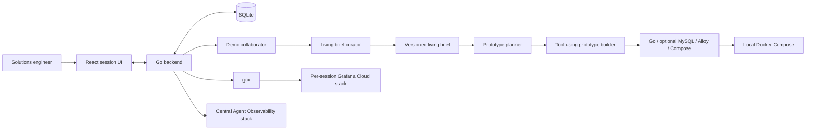
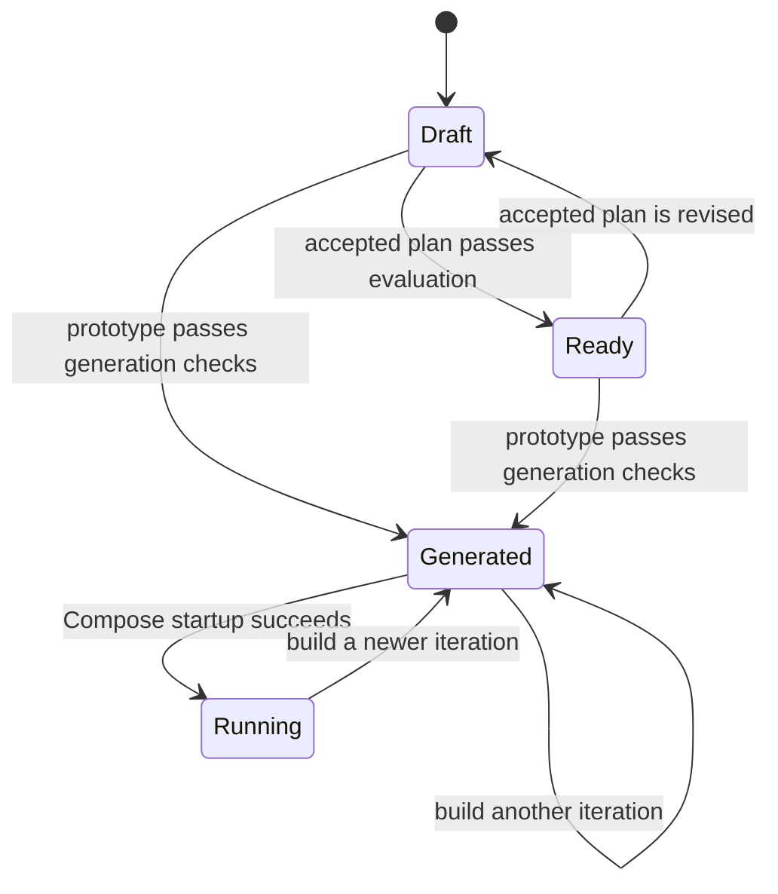

# Grafana Demo Compiler

Grafana Demo Compiler is a persistent, collaborative agent that helps a
solutions engineer turn an idea into a small, story-led Grafana demo. It uses
conversation to develop a living brief and narrative, generates an executable
Go application, validates it, creates a dedicated Grafana Cloud stack through
`gcx`, and starts the application locally with Docker Compose.

This repository is an MVP. Its goal is a convincing, inspectable vertical
slice rather than a production-ready application platform.

## What works today

- Persistent demo sessions, messages, operations, briefs, and iterations in
  SQLite.
- Streamed assistant responses and visible background-operation progress.
- A versioned living brief with proposed and confirmed decisions.
- Focused side chats for refining one brief topic before explicitly applying
  it to the main session.
- Mermaid architecture diagrams generated from the brief.
- A requirement-alignment evaluation when a plan is accepted.
- Background prototype generation using a planner and tool-using builder.
- Generated Go services, optional MySQL, Alloy, Dockerfiles, and Docker Compose.
- Fixed validation for compilation, Compose structure, required services,
  optional-MySQL policy, Alloy, and disallowed local observability backends.
- Dedicated per-session Grafana Cloud stack creation through `gcx`.
- Local Docker Compose startup with protected telemetry configuration.
- Agent Observability for the compiler's model generations and tool workflow.
- A local-only deployment API that rejects non-local targets. Broader
  natural-language request and pre-tool guards remain deferred.

Full telemetry verification, Grafana resource creation, presenter tooling, and
complete runtime controls are intentionally deferred.

## Product flow



The normal path is:

1. Create or resume a session and describe the desired demo.
2. Collaborate on the audience, outcome, narrative, application shape,
   telemetry, and small Grafana resource set.
3. Refine individual brief topics in focused side chats and explicitly confirm
   decisions that should be locked.
4. Accept a bounded prototype offer.
5. Generate and validate a prototype iteration in the background.
6. Create or reuse the session's Grafana Cloud stack through `gcx`.
7. Supply a Cloud Access Policy token when prompted so the local
   Alloy instance can send telemetry.
8. Build and start the generated application with Docker Compose.
9. Continue the conversation to revise the demo and create another iteration.

## Agent design

One human-facing voice coordinates five narrow LLM roles:

- **Demo collaborator**: shapes the narrative, scope, and next useful question.
- **Living brief curator**: converts completed conversation into structured
  shared context without speaking to the user.
- **Requirement evaluator**: checks an accepted plan against the confirmed
  audience, outcome, proof points, scenario, and requested resources.
- **Prototype planner**: records implementation decisions, alternatives,
  telemetry mapping, files, assumptions, risks, and validation intent.
- **Prototype builder**: writes the planned files and invokes fixed validation.

All role prompts are versioned under [`prompts/v2`](prompts/v2). A shared
constitution defines instruction priority, confirmed-decision behavior,
domain neutrality, local-only deployment, Grafana Cloud boundaries, and scope
discipline.

### Model tools

The LLM workflow uses typed tools rather than relying only on prose:

- `propose_brief_update`
- `record_prototype_plan`
- `write_demo_file`
- `validate_prototype`

Tool implementations constrain writes to the active iteration workspace and
run fixed application checks. Grafana Cloud and Docker actions are separate,
narrow backend operations; the browser cannot submit arbitrary shell commands.

### Backend structure

The Go backend remains one local process, with workflow boundaries expressed
as internal application services rather than network services:

- `internal/application/chat_service.go` owns main-conversation turns and
  hands completed responses to the brief workflow.
- `internal/application/brief_service.go` owns living-brief updates, focused
  topic chats, confirmation, evaluation, and session-state transitions.
- `internal/application/prototype_service.go` owns prototype iteration
  acceptance and background generation.
- `internal/application/deployment_service.go` owns the local-only guard,
  Grafana Cloud stack provisioning, secure token handoff, and Compose startup.
- `internal/httpapi` only decodes requests, translates application faults,
  and writes JSON or server-sent events.

This keeps the MVP operationally simple while separating the four workflows
that previously shared one large HTTP server implementation.

Context is compiled separately for each model role. The collaborator receives
confirmed and proposed brief facts, open questions, compact operational state,
and at most six recent messages. The brief curator receives only messages added
since the previous brief version. Focused chats receive their selected topic,
confirmed constraints, direct dependencies, and their isolated thread. The
prototype builder receives the planner's implementation contract rather than
the human conversation or living brief. Brief topics use application-owned IDs;
labels are display text and are never used for runtime routing. Each generation
records a content-free context manifest in Agent Observability with the schema
version, brief version, included and dropped sections, topic IDs, estimated
tokens, and the configured budget.

Context is budgeted conservatively using UTF-8 bytes per token. Required facts
fail explicitly if they cannot fit; optional sections are included by
role-specific priority and dropped as whole sections rather than being silently
clipped. Focused chats protect the latest user request and fit older messages
individually, newest first within the history window, presenting the retained
messages chronologically. The curator processes the largest chronological message batch that fits
and advances its cursor only through that batch. The builder checks the growing
tool transcript before every model step.

The session sidebar shows estimated context usage for the latest request from
each activity. The meter compares the estimate (including reserved overhead)
with the configured input budget, warns at 80% and 95%, and identifies requests
where optional context was trimmed. Builder usage updates before every model
step as its tool transcript grows. These snapshots reset when the server
restarts; they are not a cumulative conversation size or an exact tokenizer count.

### Model choice

The compiler uses Grafana's Go AI SDK with its native Amazon Bedrock provider
and provider-neutral Agent Observability middleware. `BEDROCK_MODEL_ID` selects
the Bedrock model or inference profile, so models can be changed without code
changes while authentication, streaming, tools, and observability remain
consistent.

Provider hot-swapping is deliberately outside this MVP. The AI SDK leaves a
clear provider boundary if another provider becomes valuable later.

## Session states

The implementation currently uses these user-visible states:



- `Draft`: conversation and brief development are in progress.
- `Ready`: the accepted plan meets or partially meets the requirement.
- `Generated`: the latest prototype iteration passed generation checks.
- `Running`: a deployment record shows that local Compose startup succeeded.

`Running` is persisted operation evidence, not a continuous health check. The
main-chat context records which prototype iteration a deployment belongs to so
a newer generated iteration is not confused with an older running one.

`Verified` remains reserved for a later end-to-end check of the application,
telemetry, approved Grafana resources, and story. It is not claimed today.

## Prerequisites

- Go 1.26 or newer.
- Node.js 24 or newer.
- A running Docker Desktop or another Docker installation with Compose v2.
- `gcx`, authenticated for Grafana Cloud stack operations with
  `gcx cloud login`.
- AWS credentials with access to the selected Bedrock model or inference
  profile.
- Agent Observability ingest credentials for the central operations stack if
  compiler observability is required.

The application itself is deployed only to the local Docker runtime. `gcx`
still creates and manages the required remote Grafana Cloud demo stack.

## Quickstart

Install dependencies and build the React application:

```bash
go mod download
cd web
npm ci
npm run build
cd ..
```

Create the local configuration:

```bash
install -m 600 .env.example .env
# Edit .env with your Bedrock and optional Agent Observability settings.
# The launch command below overrides the example's :8080 bind with loopback.
```

The compiler intentionally does not load `.env` automatically. Export it in
the shell that starts the server:

```bash
set -a
source .env
set +a
DEMO_COMPILER_ADDR=127.0.0.1:8080 go run ./cmd/server
```

Open [http://localhost:8080](http://localhost:8080). The Go backend serves the
compiled React application. The health endpoint is available at
[http://localhost:8080/api/health](http://localhost:8080/api/health).

The MVP API does not implement user authentication. Bind it to
`127.0.0.1:8080`; do not expose it to a shared or public network. If you use a
different launch mechanism, explicitly set `DEMO_COMPILER_ADDR` because the
checked-in `.env.example` currently uses the all-interface `:8080` value.

For UI development, run `npm run dev` from `web/`; Vite proxies `/api` to the
backend.

### Bedrock configuration

The required compiler settings are:

```bash
AWS_REGION=us-east-1
AWS_PROFILE=your-sso-profile            # optional when another AWS credential source is used
BEDROCK_MODEL_ID=your-model-or-inference-profile
```

The Grafana AI SDK uses the standard AWS credential chain. Changing the model
requires updating `BEDROCK_MODEL_ID` and restarting the compiler.

The context budget can be tuned without code changes:

```bash
DEMO_COMPILER_CONTEXT_MAX_INPUT_TOKENS=32000
DEMO_COMPILER_COLLABORATOR_MAX_INPUT_TOKENS=128000
DEMO_COMPILER_CONTEXT_SAFETY_TOKENS=1500
DEMO_COMPILER_CONTEXT_PROVIDER_OVERHEAD_TOKENS=1000
DEMO_COMPILER_CONTEXT_BYTES_PER_TOKEN=3
```

The collaborator (main chat) defaults to a 128,000-token input budget; its
role-specific setting does not change focused-topic or curator budgets. It does
not increase the recent-message selection window or enable summarisation.

The byte estimator intentionally errs on the conservative side. These settings
reserve room for system prompts, provider formatting, tool schemas, and model
output rather than trying to reproduce a model-specific tokenizer.

### Agent Observability configuration

Compiler telemetry is sent to the pre-provided central operations stack at
`https://democompiler.grafana.net/`. This is separate from every per-demo
Grafana Cloud stack.

Get the `AGENTO11Y_*` values and an access-policy token from the stack's
[Agent Observability Connection page](https://democompiler.grafana.net/plugins/grafana-agento11y-app).
The token needs `sigil:write`, `metrics:write`, `traces:write`, and
`logs:write`. Use the page's OpenTelemetry connection details for the OTLP
endpoint and headers.

```bash
AGENTO11Y_ENDPOINT=
AGENTO11Y_PROTOCOL=http
AGENTO11Y_AUTH_MODE=basic
AGENTO11Y_AUTH_TENANT_ID=
AGENTO11Y_AUTH_TOKEN=
OTEL_EXPORTER_OTLP_ENDPOINT=
OTEL_EXPORTER_OTLP_HEADERS=
```

The assistant remains usable when Agent Observability is not configured. The
health panel reports missing configuration. Generation inputs are passed
through the Agent Observability secret-redaction sanitizer.

### Per-demo Grafana Cloud deployment

Before deploying a generated prototype:

```bash
gcx cloud login
```

The deployment UI asks for a Grafana Cloud region, creates or reuses the
session's stack, and then requests a Cloud Access Policy token with
`stacks:read`, `metrics:write`, `logs:write`, and `traces:write`. The token is
saved in the generated iteration's local `.env` file with owner-only
permissions and supplied to the generated Alloy runtime through Compose. It is
not saved in SQLite, chat messages, progress events, generated source, or model
telemetry. Anyone with sufficient local Docker access may inspect container
configuration, so the token should be scoped and handled as a secret.

Stack creation and Docker startup run as background operations, so closing a
browser request does not intentionally cancel them. Progress and failures are
persisted on the session.

## Validation

Run the repository checks with:

```bash
go test ./...
cd web
npm run build
```

Generated application validation deliberately stays small. It checks:

- required files and at least three Go application services;
- Alloy in a valid Compose configuration, with MySQL required only when a
  database is included;
- `go build ./...`;
- `docker compose config`;
- obvious local observability backends that conflict with Grafana Cloud.

The generated-file layer separately restricts relative paths, allowed file
types, file count, total size, and infrastructure directories outside the MVP.
Telemetry variable names and raw-token authentication formats are shared between
generation and deployment in `internal/telemetryconfig`. Prototype validation
reports unsupported Alloy references and missing Compose pass-through for the
builder to repair. Deployment populates known OTLP, Prometheus, and Loki aliases
and checks the resolved container environment before starting services. It does
not print credential values or require manual editing of the demo's `.env`.

Deployment rejects the Grafana Cloud token if Compose exposes it as a build
argument.

Generated service unit and integration tests are outside the MVP scope.

## Security boundaries

- Application deployment execution is restricted to local Docker Compose by
  the UI workflow and backend deployment API. Broader natural-language intent
  and pre-tool guard coverage remains deferred.
- Generated files remain under the active session and iteration directory.
- File paths, extensions, counts, and total generated size are bounded.
- The per-demo Grafana Cloud token is not given to the model or persisted in
  SQLite, conversation, operation context, or Agent Observability attributes;
  it is stored in a protected local file and supplied to the Alloy container.
- Grafana stack mutation and Docker execution use narrow backend operations;
  there is no arbitrary command-execution API.

Generated Dockerfiles and Compose files are still model-authored content. The
current validation is appropriate for a local prototype, not a hardened
untrusted-code sandbox. Stronger rejection of privileged containers, host
networking, unsafe mounts, and dangerous build instructions would be required
before broader use.

## Known limitations and deliberate cuts

- The runtime currently supports Bedrock only, although the model is
  configurable within Bedrock.
- Full telemetry verification through `gcx` is not implemented.
- Grafana dashboards, alerts, SLOs, and other resources are not yet previewed
  or created by this workflow.
- Stop, restart, log viewing, scenario controls, and continuous per-service
  health are incomplete.
- Generated projects are not required to contain a visual application UI, and
  the compiler does not yet discover or display an `Open demo application`
  link.
- Long conversations are not yet compacted; the living brief is the intended
  basis for a future context-window strategy.
- In-flight operations are marked interrupted after a server restart rather
  than resumed automatically.
- Remote application deployment, CI, multi-user collaboration, and generated
  service test suites are intentionally excluded.

The detailed product decisions, delivery sequence, and deferred work live in
[`PLAN.md`](PLAN.md).
