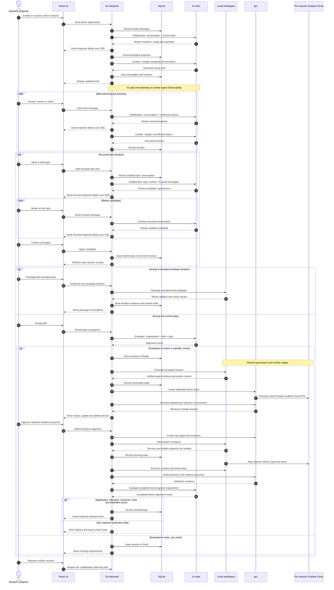
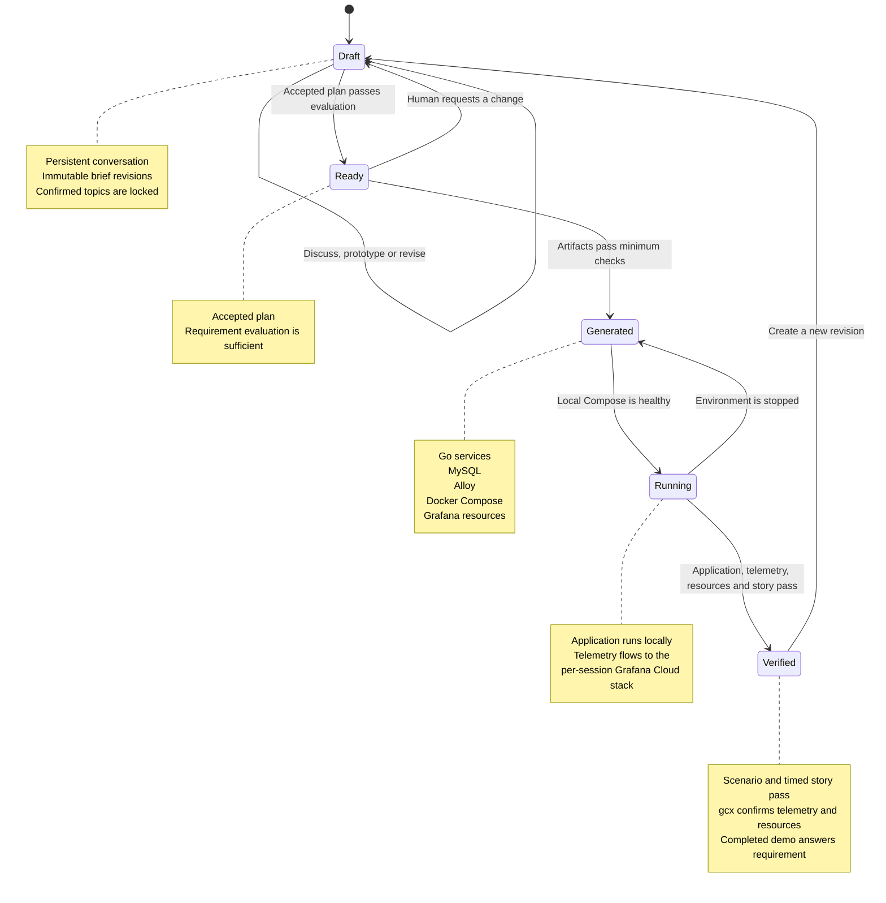

# Grafana Demo Compiler

Grafana Demo Compiler is a collaborative, local-first assistant for designing,
building, running, and validating short, story-led Grafana demos.

The MVP generates Go application services backed by MySQL and runs them locally
with Docker Compose. Remote deployment targets remain unsupported; deterministic
enforcement is deferred.
Grafana Alloy sends demo telemetry to a dedicated Grafana Cloud stack that
`gcx` creates and manages for each demo session.

The compiler sends its own agent telemetry to a separately provided central
Grafana operations stack for Agent Observability.

Development changes are made through pull requests. The initial repository
bootstrap is the only direct commit to `main`.

## How it works

The sequence below shows the persistent planning and focused-topic loops that
exist today, followed by the planned generation, local runtime, and verification
stages.



The implemented lifecycle currently reaches `Draft` and `Ready`. The
`Generated`, `Running`, and `Verified` states and their transitions are planned
for later milestones. Conversation and focused-topic work can create many
immutable brief revisions before the human approves a bounded prototype.



## Step 1 development setup

Prerequisites:

- Go 1.26 or newer.
- Node.js 24 or newer.
- AWS credentials with access to the selected Amazon Bedrock model.

Install dependencies and build the React UI:

```bash
go mod download
cd web
npm install
npm run build
cd ..
```

Create local configuration. The application intentionally does not load dotenv
files implicitly, so export the file in the shell that starts the server:

```bash
cp .env.example .env
# Edit .env without committing credentials.
set -a
source .env
set +a
go run ./cmd/server
```

Open `http://localhost:8080`. The compiled UI is served by the Go backend.
During UI development, run `npm run dev` from `web/` and use the Vite address;
it proxies `/api` to the backend.

### Amazon Bedrock

`AWS_REGION` selects the region and `BEDROCK_MODEL_ID` selects the model or
inference profile. The Grafana AI SDK uses the standard AWS credential chain.
Changing the model requires updating `BEDROCK_MODEL_ID` and restarting the
compiler, not changing code.

### Agent Observability

The `democompiler` gcx context is used to inspect the central operations stack,
but gcx authentication is not the application's telemetry credential.

Get the `AGENTO11Y_*` ingest values and create an access-policy token from the
[Agent Observability Connection page](https://democompiler.grafana.net/plugins/grafana-agento11y-app).
The token needs `sigil:write`, `metrics:write`, `traces:write`, and `logs:write`.
Use the Connection page's OpenTelemetry link to copy the generated
`OTEL_EXPORTER_OTLP_ENDPOINT` and `OTEL_EXPORTER_OTLP_HEADERS` values.

Keep all seven values from `.env.example` together. The health panel reports
exactly which values are missing and the assistant remains usable once Bedrock
is configured, even if telemetry export is not yet configured.
